# 赢单浏览器插件 UI 交接说明 v0.2.0

这份文档用于同步给 UI 同事，说明当前「赢单询盘分析」Chrome 插件在国际站询盘详情页里的主要界面状态和交互流程。

当前版本已经不是单纯弹窗，而是在国际站聊天页面内提供两个入口：

- `询盘分析`：读取当前询盘聊天记录，支持历史回溯、停止回溯、重新获取、开始分析、连续追问和历史记录。
- `客户背调`：目前是占位入口，后续会接入客户信息读取、客户Kass关联和背调报告生成。

## 一、总览图

下面这张图把本轮截图串成了一个总览，UI 同事可以先用它快速了解插件的整体界面状态。

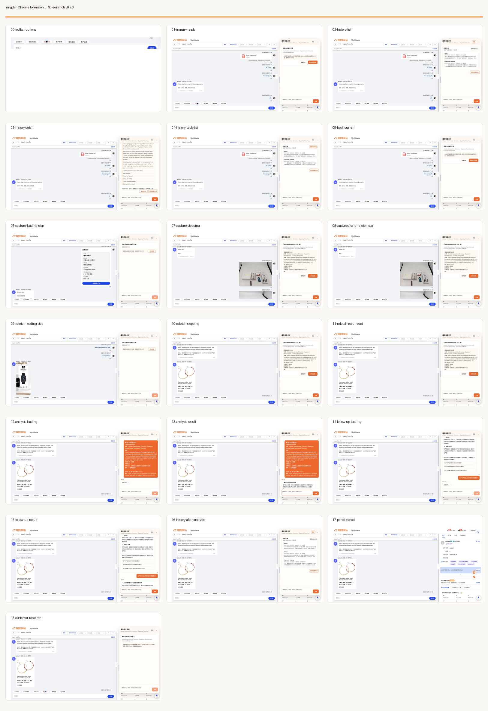

## 二、插件入口

### 1. 国际站聊天工具栏入口

当前插件在国际站聊天输入区上方的工具栏里增加两个按钮：

- `询盘分析`
- `客户背调`

UI 需要重点关注：

- 新增按钮要和国际站原生按钮同排展示，不要显得突兀。
- 两个按钮需要有明确区分，但不宜过重，避免抢走原有聊天操作的注意力。
- 当前按钮偏原生白色胶囊形态，后续可以统一成赢单品牌风格，但要保留“轻量工具入口”的感觉。

## 三、询盘分析主流程

### 2. 打开询盘分析后的初始态

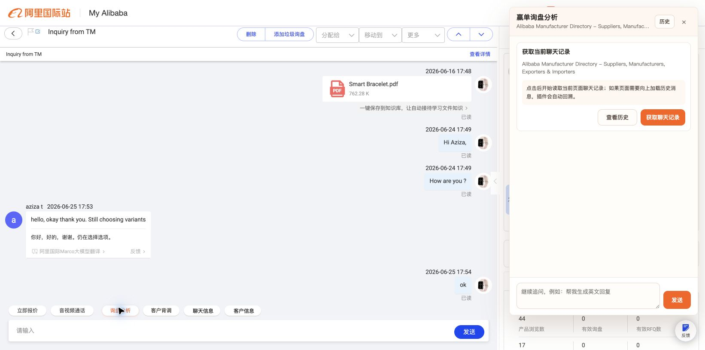

用户点击 `询盘分析` 后，右侧出现赢单侧边面板。

当前主操作是：

- `查看历史`
- `获取聊天记录`

UI 需要重点关注：

- 这个状态要让用户明白：插件还没有开始读取聊天内容，需要用户主动点击获取。
- `获取聊天记录` 是主按钮，应当明显高于 `查看历史`。
- 面板标题、副标题需要保留来源页面信息，但长标题要截断，不能撑宽面板。

### 3. 回溯加载中，可停止

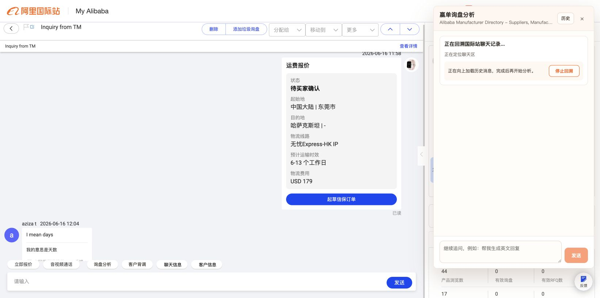

用户点击 `获取聊天记录` 后，插件会向上回溯国际站聊天历史。

当前状态包含：

- 回溯标题
- 当前回溯轮次和消息数
- `停止回溯` 按钮

UI 需要重点关注：

- 这是一个可能等待较久的状态，必须让用户知道插件还在工作。
- `停止回溯` 要放在用户容易看到的位置，不能太隐蔽。
- 回溯轮次和消息数是用户判断“有没有卡住”的关键反馈。

### 4. 用户点击停止回溯

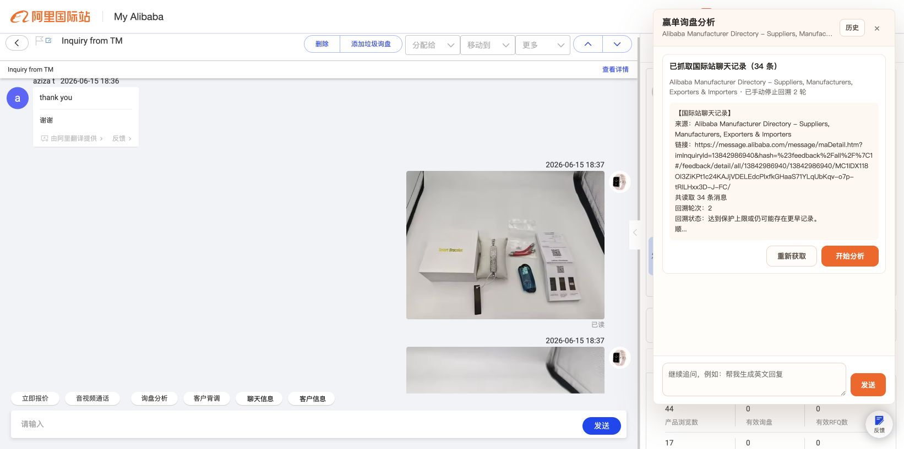

用户点击 `停止回溯` 后，按钮变为停止中状态。

UI 需要重点关注：

- 停止动作要有即时反馈，例如按钮禁用、文字变成 `正在停止`。
- 停止不是取消已读取内容，而是用当前已读取内容进入下一步。

### 5. 已抓取聊天记录

回溯完成或手动停止后，插件展示抓取结果确认卡。

当前主操作是：

- `重新获取`
- `开始分析`

UI 需要重点关注：

- 这里要让用户确认“已经抓到了什么”。
- `开始分析` 是主按钮。
- `重新获取` 是纠错入口，用户发现抓错或内容不全时可以重新读取。
- 预览区文本可能很长，必须控制高度、换行和溢出。

### 6. 重新获取流程

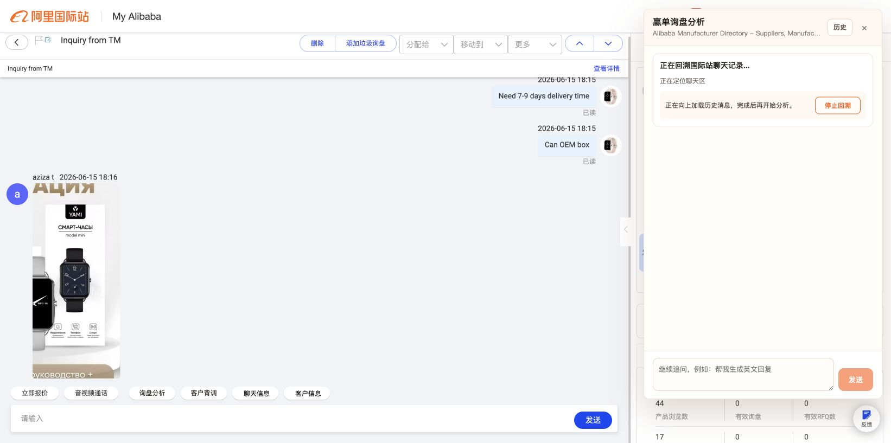

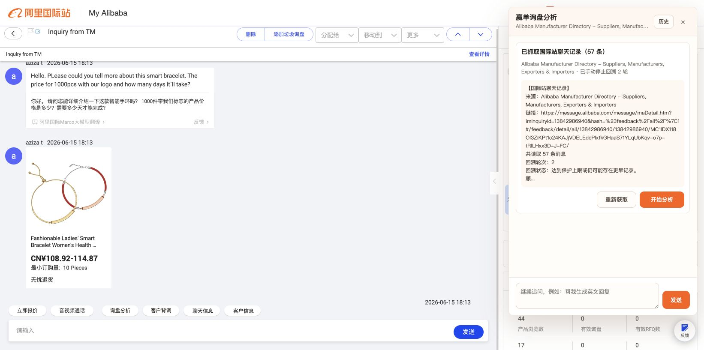

用户点击 `重新获取` 后，会重新进入回溯流程。

UI 需要重点关注：

- 重新获取和首次获取的视觉逻辑应保持一致。
- 用户不应感觉“重新获取”是另一个陌生流程。
- 停止回溯按钮仍然必须保留。

## 四、AI 分析与连续追问

### 7. 开始分析后的加载态

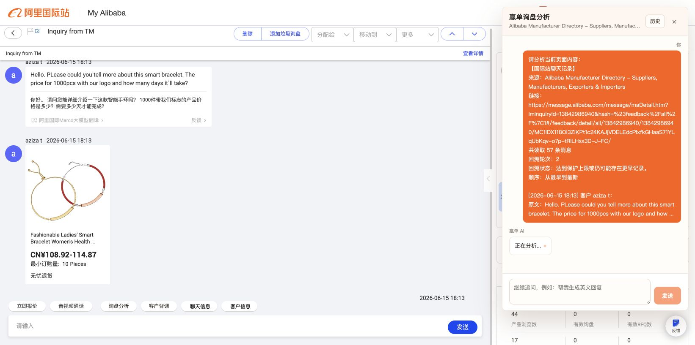

用户点击 `开始分析` 后，插件会把已抓取的聊天记录发送给赢单 AI。

UI 需要重点关注：

- 加载态要明确，但不要占用过多空间。
- 用户输入框和发送按钮在分析中会禁用，避免重复提交。

### 8. AI 分析结果

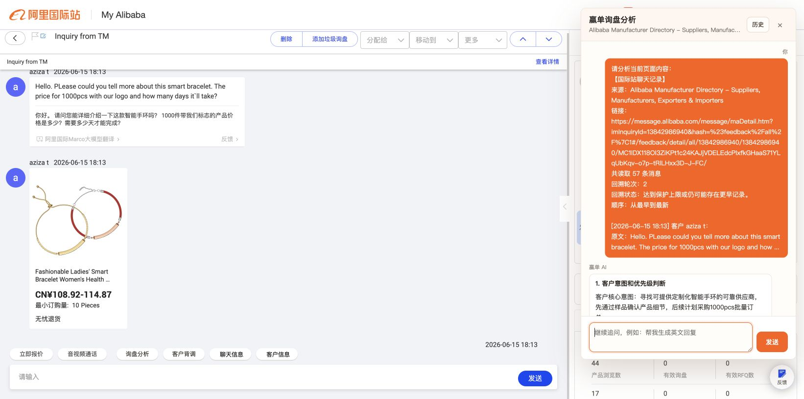

AI 返回后，面板展示：

- 用户侧抓取内容摘要
- 赢单 AI 分析结果
- 后续追问建议

UI 需要重点关注：

- AI 结果通常是长文本，需要优化段落、标题、列表和重点信息的层级。
- 当前橙色气泡面积较大，后续可以考虑优化阅读密度。
- 追问建议按钮应该像“快捷下一步”，而不是普通标签。

### 9. 点击追问建议

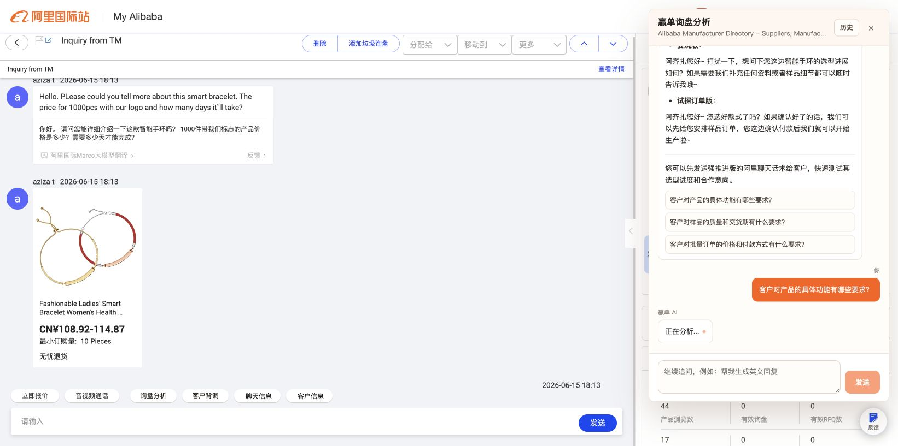

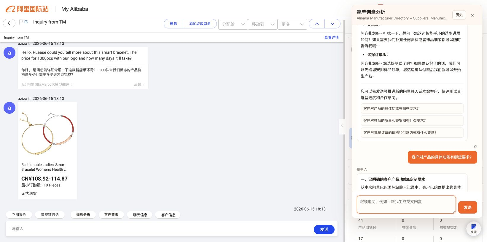

用户点击 AI 提供的追问建议后，会继续在同一个会话里追问。

UI 需要重点关注：

- 追问建议点击后，要能看出“我问了什么”和“AI 正在回答什么”。
- 追问结果和首次分析结果应保持同一套消息样式。
- 底部输入框用于用户自由追问，默认不主动发送空内容。

## 五、历史记录流程

### 10. 历史列表

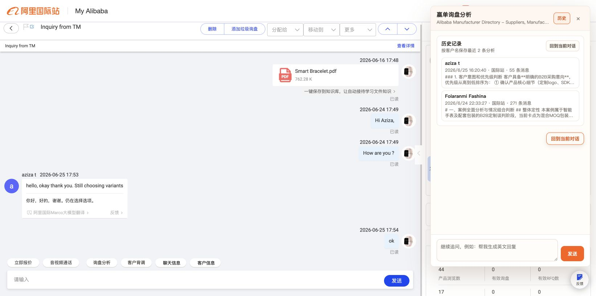

用户点击顶部 `历史` 或初始卡片里的 `查看历史` 后进入历史记录列表。

UI 需要重点关注：

- 历史卡片要比普通分析结果更短、更适合扫读。
- 每条记录至少展示客户名、时间、平台、消息数和结果摘要。
- `回到当前对话` 要明显，避免用户进入历史后找不到当前内容。

### 11. 历史详情

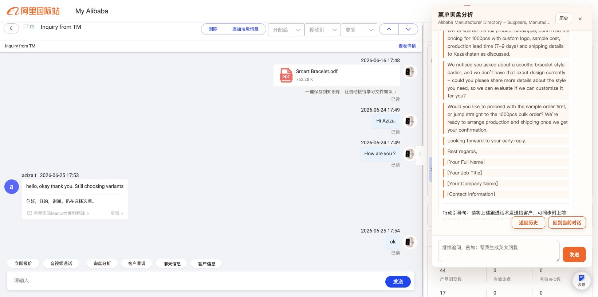

用户点击某条历史记录后进入详情页。

当前操作是：

- `返回历史`
- `回到当前对话`

UI 需要重点关注：

- 顶部和底部都应该保留返回操作，方便用户看完长内容后直接返回。
- 历史详情展示的是已保存结果，不应和当前正在分析的会话混淆。

### 12. 从历史详情返回列表

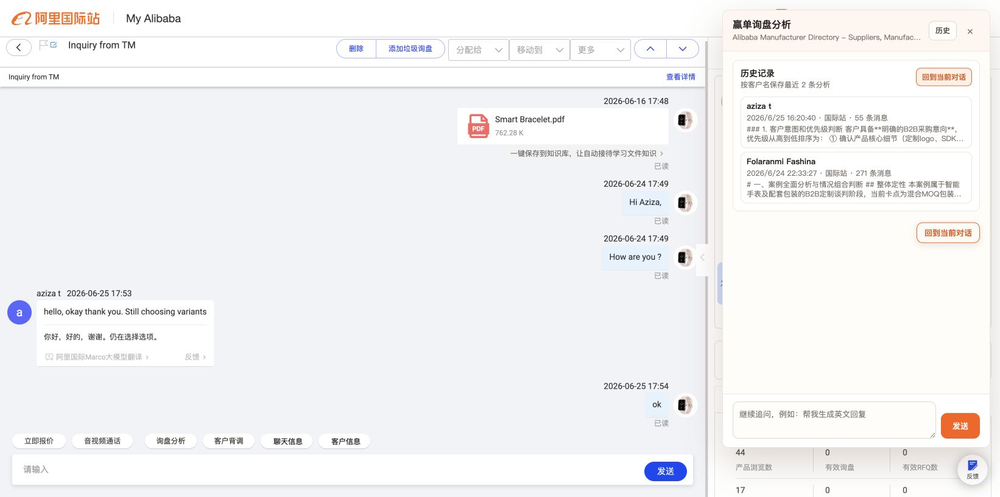

用户点击 `返回历史` 后回到历史列表。

UI 需要重点关注：

- 返回后应保持列表状态，不要误回到当前会话。
- 历史列表底部仍然保留 `回到当前对话`。

### 13. 回到当前对话

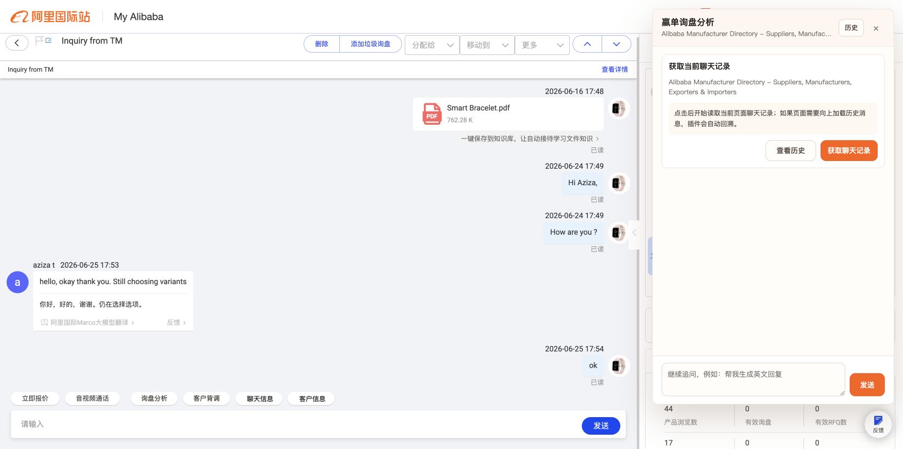

用户点击 `回到当前对话` 后，恢复进入历史前的当前询盘分析状态。

UI 需要重点关注：

- 这个按钮是历史流程里的关键逃生口。
- 位置要靠近用户当前阅读结束区域，不能只放在顶部。

### 14. 分析完成后的历史状态

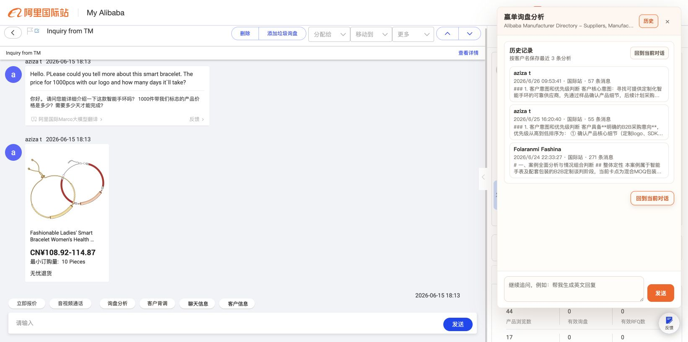

完成一次真实分析后，记录会进入历史列表。

UI 需要重点关注：

- 历史记录要能承接“刚刚分析完”的结果。
- 新记录最好在列表中有清晰位置，方便用户确认保存成功。

## 六、关闭与客户背调

### 15. 关闭面板后

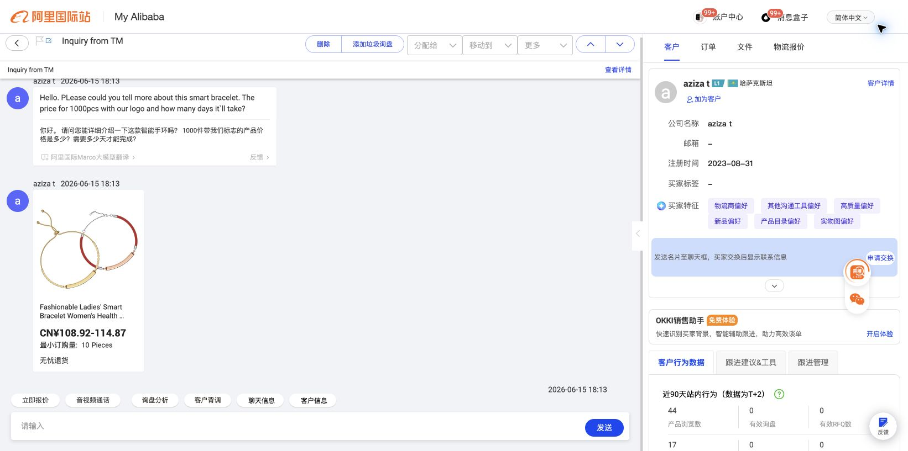

用户点击右上角 `×` 后，赢单侧边面板关闭，页面回到国际站原始聊天界面。

UI 需要重点关注：

- 关闭后不应影响国际站原有聊天区域。
- 工具栏入口仍然保留，用户可以再次打开插件。

### 16. 客户背调占位入口

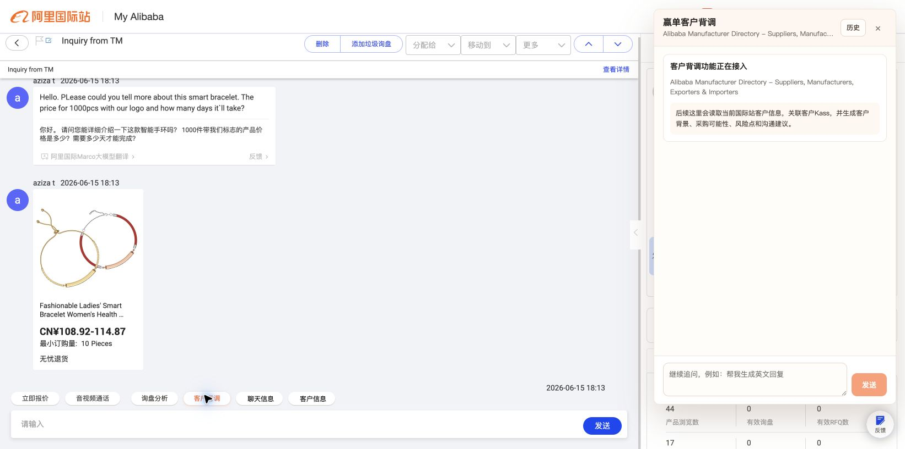

用户点击 `客户背调` 后，右侧打开客户背调占位面板。

当前文案说明后续能力会包括：

- 读取当前国际站客户信息
- 关联客户Kass
- 生成客户背景
- 判断采购可能性
- 给出风险点和沟通建议

UI 需要重点关注：

- 当前只是占位态，但入口层级已经确定。
- 后续客户背调可能需要独立的信息结构，不一定完全复用询盘分析的消息气泡样式。
- 因为客户背调暂未接入，底部输入框和发送按钮当前是禁用状态。

## 七、当前可点击项清单

本轮已实际点击并截图的插件操作包括：

- 国际站工具栏 `询盘分析`
- 国际站工具栏 `客户背调`
- 询盘分析面板顶部 `历史`
- 初始卡片 `查看历史`
- 初始卡片 `获取聊天记录`
- 回溯中 `停止回溯`
- 抓取结果卡 `重新获取`
- 抓取结果卡 `开始分析`
- AI 结果里的追问建议按钮
- 历史列表中的历史记录卡片
- 历史详情 `返回历史`
- 历史页 `回到当前对话`
- 右上角关闭按钮 `×`

没有主动测试底部空输入的 `发送`，因为空内容点击不会产生有效 UI 状态，也不应该为了截图制造无意义消息。

## 八、给 UI 同事的设计重点

### 1. 插件入口

- 入口要轻，不要干扰国际站原有工作流。
- `询盘分析` 和 `客户背调` 是两个不同任务，视觉上可以同组，但要能区分当前点击目标。

### 2. 侧边面板

- 当前面板宽度约 440px，适合快速分析，但长文本阅读会偏挤。
- 需要重点优化长文本的换行、间距、标题层级和按钮位置。
- 面板不能横向撑宽，所有 URL、英文长词和聊天原文都要安全换行。

### 3. 回溯状态

- 回溯可能持续很久，必须有清楚的进行中反馈。
- `停止回溯` 是高频救急按钮，要容易看到。
- 停止后应清楚表达“已读取当前内容，可继续分析”。

### 4. 历史记录

- 历史列表应尽量短、密、可扫读。
- 历史详情是长内容阅读场景，底部返回按钮很重要。
- `回到当前对话` 是避免迷路的关键按钮。

### 5. AI 输出

- AI 分析结果会很长，建议重点设计可读性，而不是单纯扩大气泡。
- 追问建议应像“下一步动作”，可以比普通按钮更轻，但要明确可点击。

### 6. 客户背调

- 当前只是占位态。
- 后续建议独立设计为“客户资料卡 + 背调结论 + 风险提醒 + 下一步建议”，不要完全套询盘聊天样式。

## 九、截图文件索引

| 编号 | 文件 | 状态 |
| --- | --- | --- |
| 00 | `yd-extension-v0.2.0-full-ui-00-toolbar-buttons.png` | 国际站工具栏入口 |
| 01 | `yd-extension-v0.2.0-full-ui-01-inquiry-ready.png` | 询盘分析初始态 |
| 02 | `yd-extension-v0.2.0-full-ui-02-history-list.png` | 历史列表 |
| 03 | `yd-extension-v0.2.0-full-ui-03-history-detail.png` | 历史详情 |
| 04 | `yd-extension-v0.2.0-full-ui-04-history-back-list.png` | 返回历史列表 |
| 05 | `yd-extension-v0.2.0-full-ui-05-back-current.png` | 回到当前对话 |
| 06 | `yd-extension-v0.2.0-full-ui-06-capture-loading-stop.png` | 回溯加载中 |
| 07 | `yd-extension-v0.2.0-full-ui-07-capture-stopping.png` | 正在停止回溯 |
| 08 | `yd-extension-v0.2.0-full-ui-08-captured-card-refetch-start.png` | 抓取结果卡 |
| 09 | `yd-extension-v0.2.0-full-ui-09-refetch-loading-stop.png` | 重新获取加载中 |
| 10 | `yd-extension-v0.2.0-full-ui-10-refetch-stopping.png` | 重新获取停止中 |
| 11 | `yd-extension-v0.2.0-full-ui-11-refetch-result-card.png` | 重新获取结果卡 |
| 12 | `yd-extension-v0.2.0-full-ui-12-analysis-loading.png` | AI 分析加载中 |
| 13 | `yd-extension-v0.2.0-full-ui-13-analysis-result.png` | AI 分析结果 |
| 14 | `yd-extension-v0.2.0-full-ui-14-follow-up-loading.png` | 追问加载中 |
| 15 | `yd-extension-v0.2.0-full-ui-15-follow-up-result.png` | 追问结果 |
| 16 | `yd-extension-v0.2.0-full-ui-16-history-after-analysis.png` | 分析后历史记录 |
| 17 | `yd-extension-v0.2.0-full-ui-17-panel-closed.png` | 面板关闭 |
| 18 | `yd-extension-v0.2.0-full-ui-18-customer-research.png` | 客户背调占位 |
